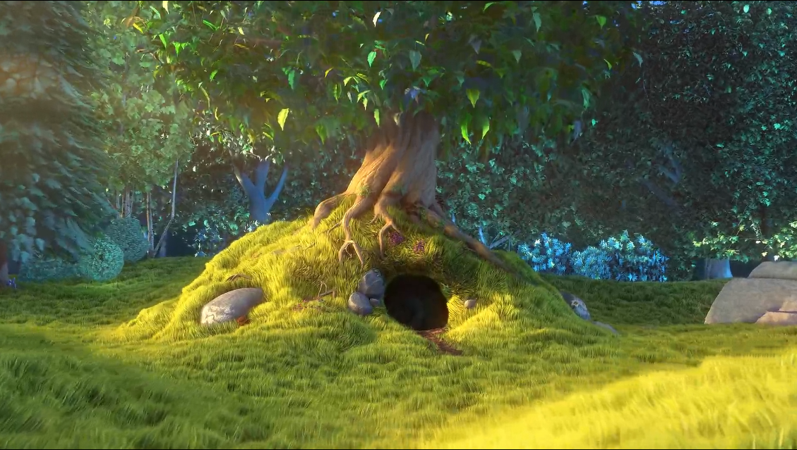

# Video_in_Video Writeup
## 제8회 BoB 정보보안 CTF (BISC) Question H

**문제 설명**
```
한가위 비디오를 찾아주세요…

참고: flag형식은 BISC{}이니 찾은 비디오에 bisc{}로 나와있으면 BISC{}로 바꿔주세요
```

- 풀이 일시: 2022-09-11
- 풀이 작성자: 진재호

이번 문제는 문제 이름 그대로 영상 속에 또 영상이 있는 구조의 문제였다. 특히, 단순히 파일 시그니처만 만지는 것이 아니라 그 구조까지 세밀하게 알고 카빙(Carving)해야 했던 것이 좋은 경험이었던 것 같다.

---
## [1] Image에서 Video 찾아내기

아래 사진은 기본으로 주어진 JPG 형식의 이미지이다.


JPG 형식의 이미지를 주고 영상을 찾아내라는 것으로 보아, 파일 시그니처를 변경해야 하는 문제겠구나라고 생각이 들었다.

후보군으로 생각해놓은 영상 확장자는 다음과 같았다.

> mp4, mov, avi, wmv, 

---
## [2] 이상한 Video

[1]의 결과를 보면 Flag는 보이지도 않고 나무만 보이는 이상한 영상이 나온다.


mp4 파일 시그니처를 가

---
## [3] 숨겨진 Video

영상이 보이는 것에 비해 필요없는 정보를 가지고 있다고 판단하여, mp4의 구조를 살펴본 후 필요없는 부분들을 골라내었다.


